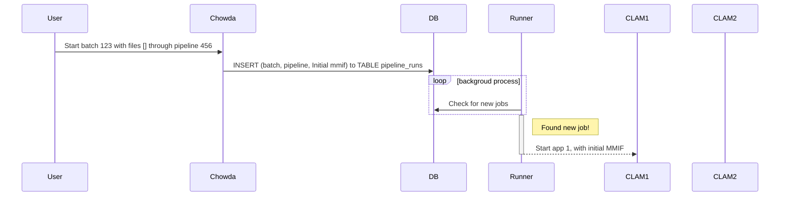

# Chowdah

CLAMS processing app

## Overview

```mermaid
sequenceDiagram
    participant User
    participant Chowda
    participant DB
    participant Runner
    participant CLAM1
    participant CLAM2

    User ->> Chowda: Start batch 123 with files [] through pipeline 456
    Chowda ->> DB: INSERT (batch, pipeline, Initial mmif) to TABLE pipeline_runs
    loop backgroud process
        Runner->> DB: Check for new jobs
    end
    activate Runner
    note right of Runner: Found new job!
    Runner-->>-CLAM1: Start app 1, with initial MMIF
```
