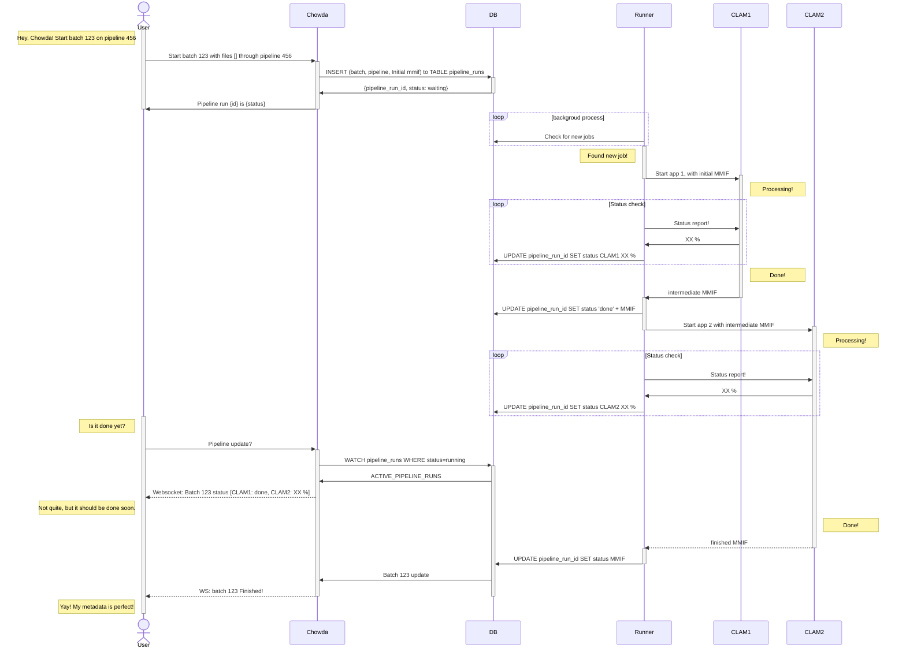

[](https://codecov.io/gh/WGBH-MLA/chowda)

# Chowda

CLAMS processing app

## Documentation

Visit the [documentation](https://wgbh-mla.github.io/chowda/) for install and usage instructions.

### Basic Pipeline with 2 CLAMS Apps

Actors:

- **User**
- **Chowda**
  - Webapp
  - Pulbicly available on internet
- **DB**
  - Postgresql
  - VPC
  - Sperate Cluster?
- **Runner**
  - Pipeline Runner
  - In CLAMS cluster
- **CLAMS**
  - Individual CLAMS apps
  - In CLAMS cluster
  - Deployed as either:
    - Webservice
    - Kubernetes Job

### Call Sequence Diagram

- **User** starts job
- **Chowda** enters it in the **DB**
- **Runner** sees new job and starts **CLAM1** with initial MMIF
- **CLAM1** Processes data and returns MMIF to **Runner**
- **Runner** Updates **DB** and starts **CLAM2**
- **CLAM2** Processes data and returns MMIF to **Runner**
- **Runner** Updates **DB**
- **User** gets data from **Chowda**



## develop

### pre-commit secret scanning

0. Install [ggshield](https://docs.gitguardian.com/ggshield-docs/getting-started)

```shell
pip install ggshield
# or
brew install gitguardian/tap/ggshield
```

1. Login to gitguardian

```shell
ggshield auth login
```

2. Install the pre-commit hooks

```shell
pre-commit install
```
